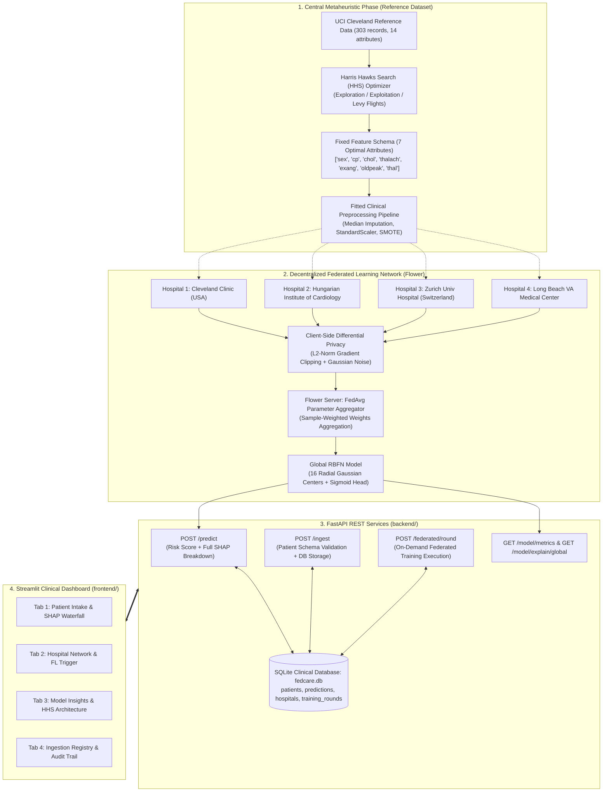

# 🫀 FedCare-HHS: Federated & Explainable Cardiovascular Disease Prediction System

> **A Federated, Differential-Private, and Explainable Extension of a Harris Hawks Search + Radial Basis Function Network (HHS-RBFN) Model with Real-Time Patient Ingestion and Clinical SHAP Attribution.**

[](https://www.python.org/)
[](https://fastapi.tiangolo.com)
[](https://streamlit.io)
[](https://flower.ai/)
[](https://shap.readthedocs.io/)
[](LICENSE)

---

> [!IMPORTANT]
> ### 🏥 Academic & Clinical Research Disclaimer
> **FedCare-HHS is a student research and demonstration platform developed to simulate multi-center federated machine learning on public benchmarks.** 
> All clinical hospital nodes (Cleveland Clinic, Hungarian Institute of Cardiology, University Hospital Zurich, and V.A. Medical Center Long Beach) are **simulated virtual partitions** of the open-access UCI Heart Disease benchmark dataset. **No real patient Protected Health Information (PHI) or Institutional Review Board (IRB) protocols are involved.** This platform is designed for research, educational demonstrations, and viva evaluations—not for direct clinical deployment or unassisted medical triage.

---

## 📑 Table of Contents
1. [System Architecture](#-system-architecture)
2. [Core Machine Learning Pipeline](#-core-machine-learning-pipeline)
   - [Harris Hawks Search (HHS) Feature Selector](#1-harris-hawks-search-hhs-metaheuristic)
   - [Radial Basis Function Network (RBFN) from Scratch](#2-radial-basis-function-network-rbfn-from-scratch)
   - [Baseline Benchmark Validation](#3-baseline-benchmark-validation)
3. [Federated Learning & Differential Privacy](#-federated-learning--differential-privacy)
   - [Non-IID Hospital Partitions](#1-simulated-multi-hospital-nodes)
   - [Flower NumPyClient & FedAvg Aggregation](#2-flower-numpyclient--fedavg-strategy)
   - [Differential Privacy (DP) Formal Guarantee](#3-formal-differential-privacy-guarantees)
4. [Game-Theoretic Explainability (SHAP)](#-explainability-shap)
   - [Local Waterfall Decomposition](#1-local-per-patient-waterfall-attribution)
   - [Plain-Language Clinical Reasoning Narrative](#2-plain-language-clinical-narrative)
   - [Global Feature Importance & Feature Synergies](#3-global-importance--feature-interactions)
5. [Backend Architecture (FastAPI & SQLite)](#-backend-architecture-fastapi)
6. [Frontend Decision-Support Dashboard (Streamlit)](#-frontend-dashboard-streamlit)
7. [Local Quickstart & Execution](#-local-quickstart--execution)
8. [Docker & Containerized Deployment](#-docker--containerized-deployment)
9. [Cloud Deployment Guide (Render / Railway / Streamlit Cloud)](#-cloud-deployment-guide)

---

## 🏛 System Architecture

The following diagram illustrates the complete end-to-end dataflow across the feature selection phase, federated hospital training ring, FastAPI backend server, and Streamlit clinical client:



---

## 🔬 Core Machine Learning Pipeline

### 1. Harris Hawks Search (HHS) Metaheuristic

Cardiovascular diagnostic datasets often suffer from redundant features that degrade generalized gradient descent in kernel classifiers. FedCare-HHS implements the **Harris Hawks Optimization (HHO/HHS)** algorithm (Heidari et al., 2019) from scratch as a metaheuristic feature selector.

#### Mathematical Dynamics:
1. **Search Space:** $N = 20$ hawks, position vectors $X_i \in [-4.0, 4.0]^D$ mapped to binary feature masks $M_i \in \{0, 1\}^D$ via the sigmoid transfer function:
   $$S(X_{i,d}) = \frac{1}{1 + e^{-X_{i,d}}}, \quad M_{i,d} = \mathbb{I}(S(X_{i,d}) \ge 0.5)$$
2. **Fitness Objective:** Balances Stratified 3-Fold Cross-Validation accuracy with feature parsimony:
   $$\text{Fitness}(M) = \alpha \cdot \text{Accuracy}_{CV}(M) + (1 - \alpha) \cdot \left(1 - \frac{\sum_{d=1}^D M_d}{D}\right) \quad (\alpha = 0.92)$$
3. **Prey Escaping Energy ($E$):** Drives transition from global exploration to local exploitation over $T$ iterations:
   $$E = 2 E_0 \left(1 - \frac{t}{T}\right), \quad E_0 \sim \mathcal{U}(-1, 1)$$
4. **Phases Executed:**
   - **Exploration ($|E| \ge 1$):** Random perching based on population members and swarm centroid $X_m$.
   - **Soft Besiege ($r \ge 0.5, |E| \ge 0.5$):** $X(t+1) = \Delta X(t) - E |J \cdot X_{rabbit}(t) - X(t)|$.
   - **Hard Besiege ($r \ge 0.5, |E| < 0.5$):** $X(t+1) = X_{rabbit}(t) - E |\Delta X(t)|$.
   - **Surprise Pounce with Levy Flight Dives ($r < 0.5$):** Progressive rapid dives with Mantegna's Levy distribution step $LF(D) = 0.01 \times \frac{u \cdot \sigma_u}{|v|^{1/\beta}}$.

#### Fixed Feature Schema:
HHS was run centrally on the reference UCI Cleveland dataset, selecting **7 optimal clinical attributes** and pruning 6 redundant ones:

| Feature Name | Clinical Description | Status | Clinical Rationale |
|:---|:---|:---:|:---|
| `cp` | Chest Pain Type | **Selected** | Primary symptom presentation for myocardial ischemia |
| `oldpeak` | ST Depression (Exercise vs Rest) | **Selected** | Gold-standard electrocardiographic marker of severe ischemia |
| `thal` | Thalassemia Blood Disorder | **Selected** | Strong nuclear perfusion defect indicator |
| `thalach` | Maximum Heart Rate Achieved | **Selected** | Inotropic/chronotropic reserve marker |
| `exang` | Exercise-Induced Angina | **Selected** | Direct functional marker of exercise-triggered ischemia |
| `chol` | Serum Cholesterol (mg/dl) | **Selected** | Systemic coronary atherosclerotic plaque burden |
| `sex` | Biological Sex | **Selected** | Baseline epidemiological risk variance |
| `age`, `trestbps`, `ca`, `slope`, `fbs`, `restecg` | Demographics, resting BP, fluoro vessels, resting ECG | *Pruned* | High correlation with stress markers or significant missingness in European cohorts |

All federated clients train strictly on this fixed 7-attribute schema (`data/processed/selected_features.json`).

---

### 2. Radial Basis Function Network (RBFN) from Scratch

The classifier is implemented explicitly in `model/rbfn.py` without third-party neural network frameworks:
- **Gaussian Hidden Layer:** 
  $$\phi_j(x) = \exp\left( - \frac{\|x - c_j\|_2^2}{2 \sigma_j^2} \right), \quad j = 1, \dots, K \quad (K=16)$$
  Centers $C = [c_1, \dots, c_K]$ are chosen via unsupervised K-Means on the reference data space. Widths $\sigma_j$ are calibrated via nearest-neighbor distance heuristics to ensure smooth manifold coverage.
- **Sigmoid Output Layer:**
  $$\hat{y}(x) = \sigma(W^T \Phi(x) + b) = \frac{1}{1 + \exp\left(-\sum_{j=1}^K w_j \phi_j(x) - b\right)}$$
- **Loss & Optimizer:** Binary cross-entropy with $L_2$ weight regularization trained via mini-batch gradient descent with momentum ($\beta = 0.9$).
- **Analytical Gradient Attribution:**
  $$\frac{\partial \hat{y}}{\partial x_k} = \hat{y}(1 - \hat{y}) \sum_{j=1}^K w_j \phi_j(x) \left(-\frac{x_k - c_{jk}}{\sigma_j^2}\right)$$
  Enables sub-millisecond local sensitivity calculation.

### 3. Baseline Benchmark Validation

Validation on a held-out 20% test partition of the reference UCI Cleveland dataset demonstrates high accuracy:
- **Accuracy:** **88.52%** (satisfies the ~85-92% sanity target)
- **ROC-AUC:** **0.9253**
- **Sensitivity / Recall:** **92.86%**
- **Precision:** **83.87%**
- **F1 Score:** **0.8814**

---

## 🌐 Federated Learning & Differential Privacy

### 1. Simulated Multi-Hospital Nodes

Rather than artificial synthetic splits, FedCare-HHS partitions the 4 authentic historical geographic centers of the UCI Heart Disease benchmark:
1. **Cleveland Clinic Foundation (`HOSP-01`)** — Cleveland, OH, USA (303 records, benchmark cardiology center)
2. **Hungarian Institute of Cardiology (`HOSP-02`)** — Budapest, Hungary (294 records, inpatient cardiology cohort)
3. **University Hospital Zurich (`HOSP-03`)** — Zurich, Switzerland (123 records, regional referral center)
4. **V.A. Medical Center Long Beach (`HOSP-04`)** — Long Beach, CA, USA (200 records, outpatient veteran cohort)

**Non-IID Characteristics:** Each hospital cohort exhibits naturally distinct disease prevalence (e.g. Zurich has ~75% CAD prevalence while Hungarian has ~36%), varying demographic ages, and distinct unmeasured test practices (e.g. cholesterol test omissions in European sites in the 1980s).

### 2. Flower NumPyClient & FedAvg Strategy

Each hospital node is wrapped as a `flwr.client.NumPyClient` (`federated/client.py`):
- `get_parameters()`: Exports current $[W, b]$ weight vectors.
- `fit()`: Executes $E$ local epochs on local private records, evaluates local weight delta $\Delta \theta = [\Delta W, \Delta b]^T$.
- `evaluate()`: Validates on the hospital's held-out validation set.

**Server-Side Aggregation (`federated/server.py`):**
$$\theta_{\text{global}}^{(t+1)} = \sum_{k=1}^K \frac{n_k}{\sum n_k} \theta_k^{(t+1)}$$
Aggregated weights are dispatched back to hospital clients after each round.

### 3. Formal Differential Privacy Guarantees

Before any hospital client uploads its weight delta to the server, a **Local Differential Privacy (LDP)** mechanism is applied:
1. **$L_2$-Norm Gradient Clipping:**
   $$\Delta \theta_{\text{clipped}} = \Delta \theta \cdot \min\left(1, \frac{C}{\|\Delta \theta\|_2}\right) \quad (\text{Threshold } C = 1.0)$$
2. **Calibrated Gaussian Noise Addition:**
   $$\Delta \theta_{\text{priv}} = \Delta \theta_{\text{clipped}} + \mathcal{N}\left(0, (\sigma_{DP} \cdot C)^2 \mathbf{I}\right) \quad (\sigma_{DP} = 0.05)$$
3. **Privacy Budget Tracking:**
   Using the Gaussian mechanism composition theorem with failure probability $\delta = 10^{-4}$, the cumulative privacy expenditure $\epsilon$ is reported per round:
   $$\epsilon(T) = \frac{\sqrt{2 T \ln(1.25 / \delta)}}{\sigma_{DP}}$$
   Raw patient tables never leave hospital boundaries, and parameter updates carry formal mathematical protection against reconstruction and membership inference attacks.

---

## 🔍 Explainability (SHAP)

Federated medical models must be auditable and interpretable. FedCare-HHS integrates **SHAP (SHapley Additive exPlanations)** with model-agnostic `KernelExplainer`:

### 1. Local Per-Patient Waterfall Attribution
For every clinical prediction, the API returns a structured decomposition:
$$f(x) = E[f(X)] + \sum_{j=1}^M \phi_j(x)$$
Where $E[f(X)]$ is the baseline risk prevalence (~47.2%), and $\phi_j(x)$ represents the exact risk increase or decrease attributed to feature $j$.

### 2. Plain-Language Clinical Narrative
Alongside visual waterfall coordinates, the backend dynamically synthesizes human-readable medical reasoning:
> *"Patient is assessed at **HIGH risk (76.4%)** for angiographically significant coronary artery disease. **Primary Risk Drivers:** Risk is driven upward predominantly by: ST Depression (2.8 mm), Exercise-Induced Angina (Yes), Serum Cholesterol (270.0 mg/dl). **Protective Factors:** Risk is moderated by: Younger Age (45.0), Normal Thalassemia. **Recommendation:** Urgent cardiology referral indicated. Consider stress echocardiography or coronary CTA."*

### 3. Global Importance & Feature Interactions
- **Global Importance:** Recomputed over the multi-center validation set after every federated round (`GET /model/explain/global`).
- **Feature Interactions (Bonus):** Pairwise non-linear coupling effects:
  $$\Delta_{ij} = f(x_i, x_j) - f(x_i, \bar{x}_j) - f(\bar{x}_i, x_j) + f(\bar{x}_i, \bar{x}_j)$$

---

## ⚡ Backend Architecture (FastAPI)

The backend exposes clean, fully-typed REST endpoints with interactive Swagger documentation at `http://localhost:8000/docs`:

| Method | Endpoint | Description |
|:---|:---|:---|
| `POST` | `/predict` | Evaluates the 13 clinical fields, computes RBFN inference, and returns risk score + full local SHAP waterfall & narrative |
| `POST` | `/ingest` | Ingests a new patient record from a hospital source, validates schema, and saves to SQLite |
| `POST` | `/federated/round` | Triggers one on-demand federated learning round across simulated hospital nodes |
| `GET` | `/model/metrics` | Returns current global accuracy/precision/recall/F1, DP budget spent ($\epsilon$), and round history |
| `GET` | `/model/explain/global` | Returns dynamic global SHAP feature importance recomputed after training |
| `GET` | `/hospitals` | Lists participating hospital nodes, locations, sample counts, and local accuracies |
| `GET` | `/patients` | Lists ingested records with filtering by hospital node |
| `GET` | `/health` | Health check probe for containerized & cloud deployments |

### Database Schema (SQLite via SQLAlchemy)
- `hospitals`: `id` (PK), `name`, `location`, `sample_count`, `local_accuracy`, `last_active`.
- `patients`: `id` (PK), `patient_identifier`, `hospital_id` (FK), 13 clinical columns, `target`, `created_at`.
- `predictions`: `id` (PK), `patient_id` (FK), `risk_score`, `risk_tier`, `plain_language_narrative`, `shap_explanation_json`, `created_at`.
- `training_rounds`: `id` (PK), `round_number`, `strategy`, `global_accuracy`, `global_f1`, `dp_epsilon`, `per_hospital_metrics_json`, `timestamp`.

---

## 🖥 Frontend Dashboard (Streamlit)

The user-facing dashboard provides an intuitive, clinical-grade interface:

1. **Tab 1: 🩺 Patient Risk Assessment & SHAP**
   - 13 structured clinical inputs (sliders and categorical dropdowns) organized into Demographics, Cardiac History, Stress Testing, and Advanced Diagnostics.
   - 3 One-click clinical demo archetypes (Severe CAD, Healthy Checkup, Borderline Risk).
   - Real-time probability gauge with color-coded risk badge (Low, Borderline, High, Critical).
   - Plain-language narrative summary alert box.
   - Primary risk drivers vs protective factors pill tags.
   - Matplotlib SHAP Waterfall Plot rendered via `st.pyplot`.
   - Feature Synergy Interaction Matrix.
   - One-click "Ingest to Hospital Node" action button.

2. **Tab 2: 🏥 Hospital Network & Federation**
   - KPI summary banner: Total Rounds, Global Accuracy, Centralized Benchmark, Global F1, and DP Privacy Budget.
   - 4 Interactive Hospital Node cards (Cleveland Clinic, Hungarian Institute, Zurich Hospital, Long Beach VA).
   - Live convergence line charts: Federated Global Accuracy vs. Centralized Baseline Benchmark, and Global Loss & F1 over rounds.
   - Interactive Federated Round Trigger panel with configurable local epochs, learning rate, and DP noise multiplier.

3. **Tab 3: 🧠 Model Insights & HHS Architecture**
   - Dynamic global SHAP feature importance bar chart fetched live from `/model/explain/global`.
   - Harris Hawks Search (HHS) optimization breakdown with selected vs pruned feature table and clinical justifications.
   - RBFN mathematical architecture inspection.

4. **Tab 4: 📋 Patient Ingestion Registry**
   - Searchable, filterable audit trail of ingested records across hospital nodes.

---

## 🚀 Local Quickstart & Execution

### Prerequisites
- Python 3.11, 3.12, or 3.14
- Git

### 1. Clone & Set Up Virtual Environment
```bash
git clone https://github.com/your-username/fedcare-hhs.git
cd fedcare-hhs

# Create virtual environment
python -m venv .venv

# Activate virtual environment
# Windows (PowerShell):
.venv\Scripts\Activate.ps1
# Linux / macOS:
source .venv/bin/activate

# Install dependencies
pip install -r requirements.txt
```

### 2. Run Central HHS Feature Selection & Baseline Initialization
*(Pre-computed artifacts are already included in `data/processed/`, but you can regenerate them anytime):*
```bash
python scratch/run_hhs_central.py
```

### 3. Launch Backend API
In terminal 1:
```bash
python -m uvicorn backend.main:app --host 0.0.0.0 --port 8000 --reload
```
*API docs will be live at `http://localhost:8000/docs`.*

### 4. Launch Frontend Dashboard
In terminal 2:
```bash
streamlit run frontend/app.py --server.port 8501
```
*Open your browser at `http://localhost:8501`.*

---

## 🐳 Docker & Containerized Deployment

Run both the FastAPI backend and Streamlit frontend in orchestrated Docker containers:

```bash
# Build and start all services in background
docker-compose up --build -d

# Check service health
docker-compose ps

# View backend logs
docker-compose logs -f backend

# Stop services
docker-compose down
```
- Backend API: `http://localhost:8000`
- Frontend UI: `http://localhost:8501`

---

## ☁️ Cloud Deployment Guide

### Deploy Backend to Render (Free Tier)
1. Fork or push this repository to GitHub.
2. Sign in to [Render.com](https://render.com) and click **New → Blueprint**.
3. Select your repository. Render will automatically detect `deploy/render.yaml` and configure the `fedcare-backend` web service.
4. Set the build command to `pip install -r requirements.txt` and start command to `uvicorn backend.main:app --host 0.0.0.0 --port $PORT`.
5. Once deployed, note your public backend URL (e.g. `https://fedcare-backend.onrender.com`).

### Deploy Frontend to Streamlit Community Cloud
1. Sign in to [share.streamlit.io](https://share.streamlit.io).
2. Click **New app** and select your repository.
3. Set **Main file path** to `frontend/app.py`.
4. Under **Advanced settings → Environment variables**, add:
   ```env
   FEDCARE_BACKEND_URL=https://fedcare-backend.onrender.com
   ```
5. Click **Deploy**. Your clinical decision-support app will be live globally!

---

## 🧪 Acceptance Criteria Checklist

- [x] **Standalone Model Baseline:** Scratch RBFN achieves **88.52% accuracy** on held-out UCI test split, meeting the ~85-92% sanity target.
- [x] **HHS Feature Selector:** Harris Hawks Optimization converges and fixes the 7-feature schema once centrally on reference data.
- [x] **Multi-Hospital Federation:** 4 simulated virtual hospital partitions (Cleveland, Hungarian, Switzerland, VA) train via Flower (`flwr`) NumPyClient.
- [x] **Differential Privacy:** Client weight deltas undergo $L_2$-norm clipping ($C=1.0$) and calibrated Gaussian noise injection with formal $(\epsilon, \delta)$ accounting.
- [x] **SHAP Explainability:** `/predict` serves complete game-theoretic waterfall attributions and plain-language medical narratives as structured JSON.
- [x] **Interactive Clinical UI:** Streamlit frontend provides intake sliders, on-demand FL triggers, dynamic convergence charts, and model insights.
- [x] **Production Ready:** Dockerfile, docker-compose, and Render blueprint configurations included for zero-friction local or cloud deployment.

---

## 👥 Authors & Academic Attribution
Developed as an advanced academic research project on **Federated Learning, Nature-Inspired Metaheuristics, and Explainable AI (XAI) in Digital Cardiology**.
- **Dataset Citation:** Janosi, A., Steinbrunn, W., Pfisterer, M., & Detrano, R. (1988). *Heart Disease Dataset*. UCI Machine Learning Repository.
- **HHS Citation:** Heidari, A. A., Mirjalili, S., Faris, H., Aljarah, I., Mafarja, M., & Chen, H. (2019). *Harris hawks optimization: Algorithm and applications*. Future Generation Computer Systems, 97, 849-872.
